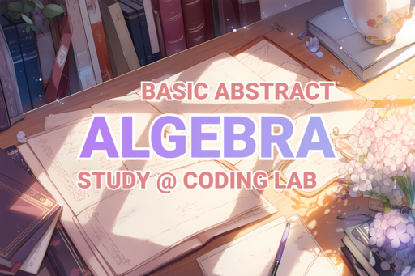

# 2026 Basic Abstract Algebra Study

A repository containing the materials for the 2026 Basic Abstract Algebra study by Coding Lab, including lecture resources, handouts, and miscellaneous assets.

## Checkout

You should clone the repository with submodules.

```sh
git clone --recurse-submodules https://github.com/coding-1ab/2026-basic-abstract-algebra-study.git

nix develop . # or, simply run `direnv allow` if you have direnv installed.
```

## Build

```sh
just
```

## License

Unless otherwise noted, all original content in this repository is copyright (c) 2026 [Coding Lab](https://github.com/coding-1ab). All rights reserved.

Lectures and all the intellectual properties are authored by [@abiriadev (Hunee Park)](https://github.com/abiriadev).

Code under `/exm` is attributed to [Tim Xie](https://github.com/pdtxie), from the original source [data-8/exm](https://github.com/data-8/exm), and is provided under the MIT License.

If you use this repository in teaching, or derived materials, please cite it as specified in [`CITATION.cff`](./CITATION.cff).
